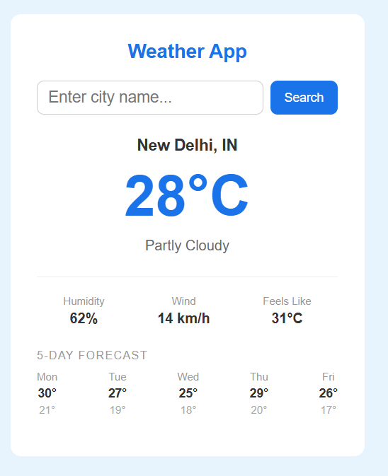

# 🌦️ Weather App

A modern weather application that provides real-time weather updates and a 5-day forecast using the OpenWeather API.

---

## 🔗 Live Demo

👉 (Add your deployed link here)

---

## 📸 Preview


 

---

## 🚀 Features

* 🔍 Search weather by city name
* 🌡️ Real-time temperature in Celsius
* ☁️ Weather conditions (Clouds, Rain, Haze, etc.)
* 💨 Wind speed and humidity
* 🤒 Feels-like temperature
* 📅 5-day weather forecast
* ⚡ Fast and responsive UI

---

## 🛠️ Tech Stack

* HTML5
* CSS3
* JavaScript (Vanilla JS)
* OpenWeather API

---

## 📡 API Endpoints

### 🔹 Current Weather

```
https://api.openweathermap.org/data/2.5/weather?q={city}&appid={API_KEY}&units=metric
```

### 🔹 5-Day Forecast

```
https://api.openweathermap.org/data/2.5/forecast?q={city}&appid={API_KEY}&units=metric
```

---

## ⚙️ Installation & Setup

1. Clone the repository

```
git clone https://github.com/your-username/weather-app.git
```

2. Navigate to project folder

```
cd weather-app
```

3. Add your API key in `script.js`

```js
const API_KEY = "75d7efcb7b78218a52e2304533996930";
```

4. Open `index.html` in your browser

---

## 🧠 How It Works

* Fetches data using `fetch()` and `async/await`
* Uses **two API calls**:

  * Current weather (`/weather`)
  * Forecast (`/forecast`)
* Updates UI dynamically using DOM manipulation

---

## ❗ Challenges Faced

* Handling API responses and errors
* Converting temperature from Kelvin to Celsius
* Working with forecast data (3-hour intervals → daily format)
* Fixing DOM loading issues (`null` errors)

---

## 📂 Project Structure

```
weather-app/
│
├── index.html
├── style.css
├── script.js
└── README.md
```

---

## 💡 Future Improvements

* 📍 Detect user location automatically
* 🌙 Dark mode
* 🎨 Better UI/UX design
* 📱 Fully responsive design
* 🌐 Add more weather details

---

## 🙋‍♂️ Author

Your Name

---

## ⭐ Support

If you like this project, consider giving it a ⭐ on GitHub!
